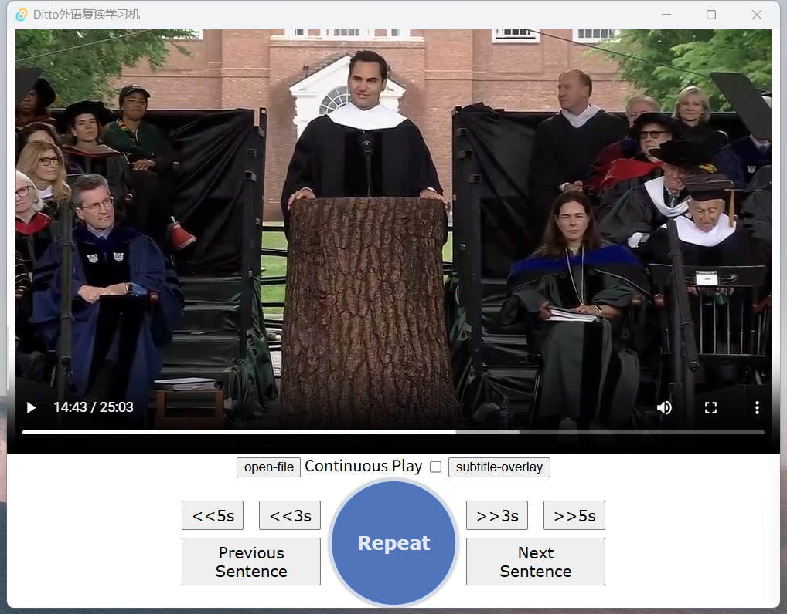

## Language Learning Player 🗣️

This is a video and audio player designed specifically for language learners. 
It's a simple tool that allows you to play media **sentence by sentence**, 
making it easy to focus on and repeat specific parts until you've mastered them. 🚀



## Features ✨

- **Sentence-by-Sentence Playback:** Break down videos and audio into manageable 
chunks for focused learning.

- **Easy Repetition:** Repeat any sentence as many times as you need to perfect 
your pronunciation and comprehension.

- **Simple Interface:** A clean, no-frills player that gets out of your way so 
you can concentrate on the content.

## How to Use 🎮

Before you can use this player, you need to generate a sentence timestamp file 
for your media. This is done using the amazing [Silero VAD](https://github.com/snakers4/silero-vad) 
(Voice Activity Detection) tool.

### 1. Generate the VAD File:

- First, make sure you have **Silero VAD** installed in your Python environment.

- Navigate to your project's directory.

- Run the included vad.py script, providing the path to your media file.

```bash
.venv/bin/python3 vad.py /path/to/your/media.mp4
```

- This will create a new file with a `.stts` extension (e.g., `media.stts`) in 
the same directory as your media. This file contains the timestamps for each sentence.

### 2. Open the Player:

- Launch the language learning player.

- Open your media file (`.mp4`, `.mp3`, etc.). The player will automatically 
detect and use the `.stts` file for sentence playback.

<hr/>

## Building from Source 🛠️

This project is built using **Tauri** and **Rust**.

- Development:

```bash
cargo tauri dev
```

- Production Build:

```bash
cargo tauri build
```

- **Tip for China-based users:** You can speed up your Rust crate downloads by 
using the Bytedance mirror.

```
https://rsproxy.cn/
```
